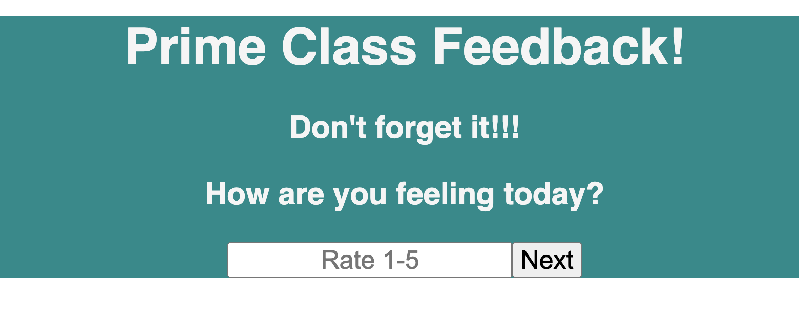
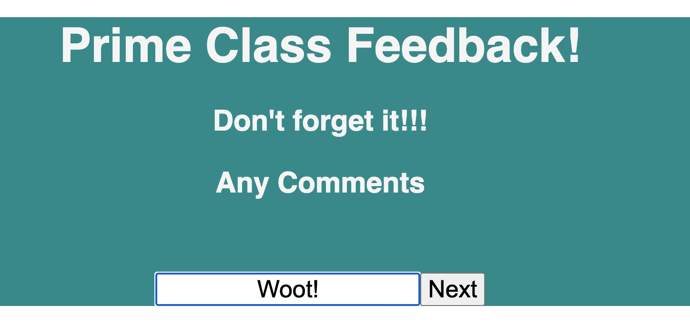

# Prime Class feedback

## Description

Duration: 12 hours

Our client wanted a site where users could give feedback on their class experience each day. They wanted a nummerical ranking system (1-5, 1 being poor and 5 being great) for fields including content understanding, support, and feeling.

Here's a view of what one of those pages could look like:

They also requested a place for comments so users could give additional feedback or suggestions.

Here's what the comments page might look like:

After each field, all of which were required except comments, was complete they gave a chance to review feedback before submitting. Once the user clicked submit the site returns to the initial page.

To create an API such as this one you would need:
React
Redux
Node_Modules

Additional README details can be found [here](https://github.com/PrimeAcademy/readme-template/blob/master/README.md).
