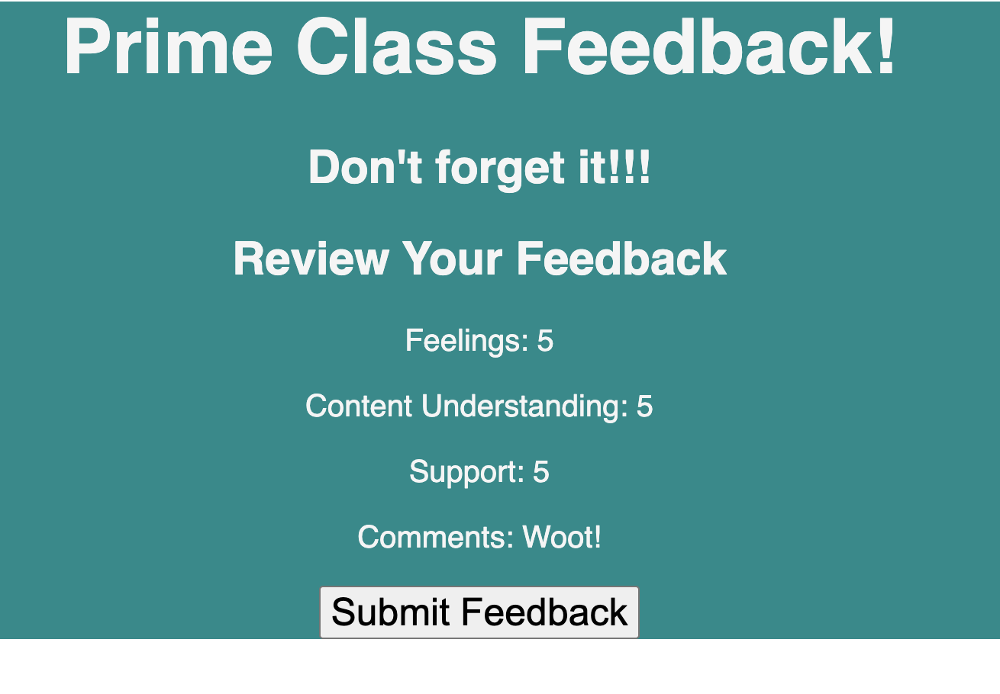
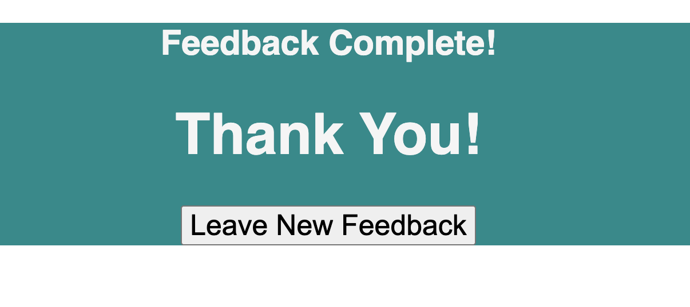

# Prime Class feedback

## Description

Duration: 12 hours

Our client wanted a site where users could give feedback on their class experience each day. They wanted a nummerical ranking system (1-5, 1 being poor and 5 being great) for fields including content understanding, support, and feeling.
Here's a view of what one of those pages could look like:

They also requested a place for comments so users could give additional feedback or suggestions.
Here's what the comments page might look like:

All fields were required except the comments page. After the survey was complete the client wanted the user to have a chance to review feedback before submitting.
Here's a look at the review page:

Once the user clicked submit they receive a 'Thank You' and have the option to leave new feedback by clicking on that button.

## Installation

1. Clone this repository and open in VS Code or another code editor
1. Run 'npm install' to get dependencies
1. Create a database in Postico (or another database)
   1. To use current code the database needs to be named "prime_feedback"
   1. You'll find table information in the data.sql file
1. Open two terminal windows:
   1. Run 'npm run server' in one
   1. Run 'npm run client' in the other

## Usage

1. The user will answer the first question of, "How are you feeling today?". Then the user will click next and it will move onto the next question. If the user does not answer they receive an alert stating they did not answer.
1. The second and third questions have the same format. After completing the third question the user is brought to the comments page. There they have the option of leaving feedback or not. Once they click next they are brought to the review page.
1. The review page shows all of their feedback and a submit button. Once subtmitted they are brought to a Thank You page.
1. The Thank You page has a button for the user to click if they would like to leave more feedback.

## Built With:

- CSS
- JavaScript, JSX
- React.js
- Redux
- Node.js
- Express
- JSON
- PostgreSQL
- SQL
- Postico
